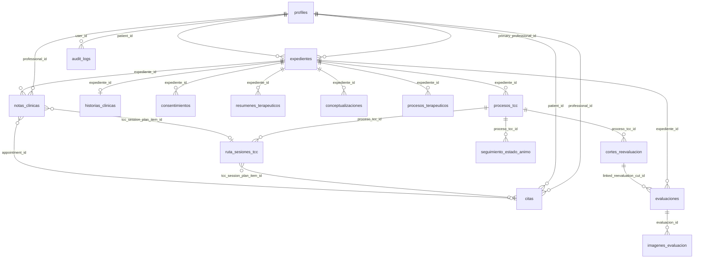

# Visión General del Modelo de Datos

Mapa de alto nivel de las entidades principales de Supabase, sus relaciones y la estrategia de Row Level Security (RLS). Está pensado como referencia rápida antes de crear migraciones; las definiciones completas de columnas y políticas RLS viven en `supabase/migrations/`.

**Principio rector**: toda tabla que contenga datos clínicos es inaccesible para los roles `administrador` y `super_administrador` mediante políticas RLS desde la primera migración. Ver restricción 2 en `docs/mvp-scope.md`.

---

## Diagrama de entidades principales



---

## Grupos de entidades

### Grupo 1 — Identidad y acceso

| Tabla | Módulo | Descripción |
|---|---|---|
| `profiles` | USERS-002 | Extiende `auth.users` de Supabase. Contiene nombre, rol, estado de cuenta y organización. |
| `organizations` | USERS-002 | Organización o clínica. Agrupa Profesionales y Pacientes. |
| `gcal_tokens` | GCAL-009 | Tokens OAuth de Google Calendar por Profesional. Solo accesible por el Profesional propietario. |

---

### Grupo 2 — Expediente clínico (núcleo)

| Tabla | Módulo | Descripción |
|---|---|---|
| `expedientes` | EXPEDIENTE-003 | Contenedor maestro. Vincula Paciente, Profesional y organización. Estado: `activo`, `archivado`, `bloqueado`. |
| `historias_clinicas` | EXPEDIENTE-003 | Relación 1:1 con `expedientes`. Historia clínica psicológica completa. |
| `consentimientos` | EXPEDIENTE-003 | Consentimientos informados vinculados al expediente. Estado: `pendiente`, `firmado_fisico`, `firmado_digital`, `excepcion_justificada`. |
| `resumenes_terapeuticos` | EXPEDIENTE-003 | Resúmenes redactados o generados con IA y aprobados por el Profesional. Visibles en el portal del Paciente cuando están publicados. |
| `conceptualizaciones` | EXPEDIENTE-003 | Conceptualizaciones clínicas del caso. Se versiona: las versiones anteriores no se eliminan. Fuente: `manual` o `ia_asistida`. Requiere aprobación del Profesional. |

---

### Grupo 3 — Procesos terapéuticos

| Tabla | Módulo | Descripción |
|---|---|---|
| `procesos_terapeuticos` | PROCESO-GENERAL-005 | Proceso terapéutico de modelo General, configurable por el Profesional. |
| `plantillas_proceso` | PROCESO-GENERAL-005 | Plantillas de proceso general que el Profesional puede editar. Se versiona; los procesos en curso no se alteran al cambiar la plantilla. |
| `procesos_tcc` | PROCESO-TCC-006 | Proceso terapéutico del modelo TCC. Estructura predefinida por Catholizare. Estado: `preparacion`, `activo`, `en_reevaluacion`, `ajustado`, `cerrado`, `archivado`. |
| `plantillas_tcc` | PROCESO-TCC-006 | Plantilla base TCC. Solo editable por el equipo de Catholizare (Super Administrador). El proceso guarda un `template_snapshot` al inicio para aislar cambios futuros. |
| `ruta_sesiones_tcc` | PROCESO-TCC-006 | Ruta terapéutica editable por sesiones. Cada fila es un paso planeado. Estado: `planeada`, `realizada`, `ajustada`, `cancelada`. |
| `cortes_reevaluacion` | PROCESO-TCC-006 | Cortes de reevaluación periódicos del proceso TCC. Vincula evaluaciones comparadas y cambios clínicos. |
| `seguimiento_estado_animo` | PROCESO-TCC-006 | Registro de estado de ánimo por sesión TCC. Escalas numéricas 1-10. Solo visible para el Profesional en MVP. |

---

### Grupo 4 — Notas clínicas

| Tabla | Módulo | Descripción |
|---|---|---|
| `notas_clinicas` | NOTAS-004 | Notas clínicas de sesión. Estado: `borrador`, `confirmada`, `corregida`, `anulada`. Vinculadas a expediente, cita, proceso y —si aplica— a sesión TCC. Nunca eliminación física. |

---

### Grupo 5 — Evaluaciones psicológicas

| Tabla | Módulo | Descripción |
|---|---|---|
| `evaluaciones` | EVAL-014 | Registro de evaluaciones psicológicas. Resultado validado persiste. Puede vincularse a corte de reevaluación TCC. |
| `imagenes_evaluacion` | EVAL-014 | Imágenes cargadas para análisis por IA. **TTL: 24 horas.** Se eliminan automáticamente mediante Edge Function + pg_cron. El resultado validado permanece en `evaluaciones`. |

---

### Grupo 6 — Agenda e integraciones

| Tabla | Módulo | Descripción |
|---|---|---|
| `citas` | AGENDA-008 | Citas del Profesional con Pacientes. Puede vincularse a proceso terapéutico, proceso TCC y sesión planeada de la ruta TCC. Estado: `programada`, `completada`, `cancelada`. |

---

### Grupo 7 — Recursos Pro y soporte

| Tabla | Módulo | Descripción |
|---|---|---|
| `recursos_pro` | PRO-013 | Recursos y banners de Catholizare Pro. Visibles solo para el Profesional. Gestionados por Super Administrador. |

---

### Grupo 8 — Auditoría

| Tabla | Módulo | Descripción |
|---|---|---|
| `audit_logs` | LOG (transversal) | Registro de toda acción sensible. Campos mínimos: `user_id`, `role`, `action`, `entity_type`, `entity_id`, `result`, `ip_address`, `created_at`. Append-only; nunca se modifica ni elimina. |

---

## Campos clave por tabla

### `profiles`

| Campo | Tipo | Notas |
|---|---|---|
| `id` | `uuid` | FK a `auth.users.id` |
| `organization_id` | `uuid` | FK a `organizations` |
| `role` | `text` | `paciente`, `profesional`, `administrador`, `super_administrador` — espejo de `app_metadata` en JWT |
| `full_name` | `text` | — |
| `account_status` | `text` | `activo`, `inactivo`, `pendiente_activacion` |
| `assigned_professional_id` | `uuid` | Solo para Pacientes; FK a `profiles` |
| `created_by` | `uuid` | FK a `profiles` del creador |

### `expedientes`

| Campo | Tipo | Notas |
|---|---|---|
| `id` | `uuid` | PK |
| `patient_id` | `uuid` | FK a `profiles` |
| `primary_professional_id` | `uuid` | FK a `profiles` |
| `organization_id` | `uuid` | FK a `organizations` |
| `identification_data` | `jsonb` | Datos de identificación y contacto (protegidos) |
| `consent_status` | `text` | `pendiente`, `firmado_fisico`, `firmado_digital`, `excepcion_justificada` |
| `patient_summary_status` | `text` | `no_publicado`, `publicado`, `despublicado` |
| `status` | `text` | `activo`, `archivado`, `bloqueado` |
| `last_clinical_activity_at` | `timestamptz` | Para calcular TTL de retención (≥ 5 años) |

### `procesos_tcc`

| Campo | Tipo | Notas |
|---|---|---|
| `id` | `uuid` | PK |
| `expediente_id` | `uuid` | FK a `expedientes` |
| `patient_id` | `uuid` | FK a `profiles` |
| `professional_id` | `uuid` | FK a `profiles` |
| `model_type` | `text` | Siempre `tcc` en esta tabla |
| `template_version` | `text` | Versión de plantilla base al inicio |
| `template_snapshot` | `jsonb` | Copia inmutable de la plantilla al inicio del proceso |
| `status` | `text` | `preparacion`, `activo`, `en_reevaluacion`, `ajustado`, `cerrado`, `archivado` |
| `conceptualization_id` | `uuid` | FK a `conceptualizaciones` (vigente) |
| `treatment_plan_id` | `uuid` | FK interna al plan vigente |
| `gpt_instructions` | `text` | Directrices del Profesional para GPT-007 |
| `mood_tracking_entries` | `uuid[]` | Referencias a `seguimiento_estado_animo` |
| `reevaluation_cuts` | `uuid[]` | Referencias a `cortes_reevaluacion` |

### `citas`

| Campo | Tipo | Notas |
|---|---|---|
| `id` | `uuid` | PK |
| `professional_id` | `uuid` | FK a `profiles` |
| `patient_id` | `uuid` | FK a `profiles` |
| `process_id` | `uuid` | Proceso general vinculado, opcional |
| `tcc_process_id` | `uuid` | Proceso TCC vinculado, opcional |
| `tcc_session_plan_item_id` | `uuid` | Sesión planeada en ruta TCC, opcional |
| `scheduled_at` | `timestamptz` | — |
| `duration_minutes` | `int` | — |
| `type` | `text` | `presencial`, `videollamada` |
| `zoom_join_url` | `text` | Enlace de participante (visible en portal del Paciente) |
| `zoom_start_url` | `text` | Enlace de anfitrión (solo visible para el Profesional) |
| `google_calendar_event_id` | `text` | ID del evento en Google Calendar |
| `status` | `text` | `programada`, `completada`, `cancelada` |

### `notas_clinicas`

| Campo | Tipo | Notas |
|---|---|---|
| `id` | `uuid` | PK |
| `expediente_id` | `uuid` | FK a `expedientes` |
| `patient_id` | `uuid` | FK a `profiles` |
| `professional_id` | `uuid` | FK a `profiles` |
| `appointment_id` | `uuid` | Cita vinculada, opcional |
| `process_id` | `uuid` | Proceso general, opcional |
| `tcc_process_id` | `uuid` | Proceso TCC vinculado, opcional |
| `tcc_session_plan_item_id` | `uuid` | Sesión TCC vinculada, opcional |
| `tcc_session_number` | `int` | Número de sesión TCC, si aplica |
| `tcc_phase` | `text` | Fase del proceso TCC al momento de la nota |
| `mood_score` | `int` | Estado de ánimo 1-10, registrado en la sesión |
| `anxiety_score` | `int` | Ansiedad subjetiva 1-10, opcional |
| `hope_score` | `int` | Esperanza subjetiva 1-10, opcional |
| `content` | `text` | Cuerpo de la nota clínica (protegido) |
| `status` | `text` | `borrador`, `confirmada`, `corregida`, `anulada` |
| `confirmed_at` | `timestamptz` | Fecha de confirmación |
| `note_type` | `text` | `sesion`, `referencia_traslado`, `egreso`, `inicial`, etc. |

### `evaluaciones`

| Campo | Tipo | Notas |
|---|---|---|
| `id` | `uuid` | PK |
| `expediente_id` | `uuid` | FK a `expedientes` |
| `professional_id` | `uuid` | FK a `profiles` |
| `linked_tcc_process_id` | `uuid` | Proceso TCC relacionado, si aplica |
| `linked_reevaluation_cut_id` | `uuid` | Corte de reevaluación relacionado, si aplica |
| `instrument_name` | `text` | Nombre de la prueba o inventario |
| `applied_at` | `date` | Fecha de aplicación |
| `scores` | `jsonb` | Puntajes validados |
| `interpretation` | `text` | Interpretación clínica validada por el Profesional |
| `comparison_notes` | `text` | Notas de comparación respecto a evaluaciones previas |
| `ai_draft` | `text` | Borrador de análisis generado por GPT-007 (no guardado hasta aprobación) |
| `ai_approved_by` | `uuid` | Profesional que aprobó el análisis de IA |
| `status` | `text` | `pendiente_analisis`, `borrador_ia`, `validado` |

### `imagenes_evaluacion`

| Campo | Tipo | Notas |
|---|---|---|
| `id` | `uuid` | PK |
| `evaluacion_id` | `uuid` | FK a `evaluaciones` |
| `storage_path` | `text` | Ruta en Supabase Storage (bucket privado) |
| `uploaded_at` | `timestamptz` | Fecha de carga — base para calcular TTL de 24 h |
| `expires_at` | `timestamptz` | `uploaded_at + interval '24 hours'` |
| `deleted_at` | `timestamptz` | Null hasta que el job la elimina |

### `audit_logs`

| Campo | Tipo | Notas |
|---|---|---|
| `id` | `uuid` | PK |
| `user_id` | `uuid` | FK a `profiles` |
| `role` | `text` | Rol activo al momento de la acción |
| `action` | `text` | Tipo de acción: `create`, `read`, `update`, `confirm`, `export`, `ai_request`, `login`, etc. |
| `entity_type` | `text` | Tabla o entidad afectada |
| `entity_id` | `uuid` | ID del registro afectado |
| `result` | `text` | `success`, `denied`, `error` |
| `ip_address` | `inet` | Dirección IP del cliente |
| `metadata` | `jsonb` | Contexto adicional relevante |
| `created_at` | `timestamptz` | Timestamp del evento |

---

## Estrategia RLS por grupo de datos

| Grupo | Quién puede leer | Quién puede escribir | Notas |
|---|---|---|---|
| `profiles` | El propio usuario; Administrador ve su organización (sin datos clínicos) | El propio usuario; Administrador para su org; Super Administrador | Sin datos clínicos en esta tabla |
| `expedientes` | Profesional asignado; paciente ve solo su estado no clínico | Profesional asignado | Administrador: solo `status`, `consent_status`. Sin `identification_data` ni `clinical_history` |
| `historias_clinicas` | Solo Profesional asignado | Solo Profesional asignado | Inaccesible para Administrador y Super Administrador |
| `consentimientos` | Profesional asignado | Profesional asignado | — |
| `resumenes_terapeuticos` | Profesional asignado + Paciente (solo registros con `status = publicado`) | Solo Profesional asignado | El Paciente nunca ve borradores de IA |
| `conceptualizaciones` | Solo Profesional asignado | Solo Profesional asignado | — |
| `procesos_terapeuticos` / `procesos_tcc` | Solo Profesional asignado | Solo Profesional asignado | — |
| `ruta_sesiones_tcc` / `cortes_reevaluacion` / `seguimiento_estado_animo` | Solo Profesional asignado | Solo Profesional asignado | — |
| `notas_clinicas` | Solo Profesional asignado | Solo Profesional asignado | Paciente no accede en MVP |
| `evaluaciones` | Solo Profesional asignado | Solo Profesional asignado | Paciente no ve resultados completos en MVP |
| `imagenes_evaluacion` | Solo Profesional asignado | Solo Profesional asignado; Edge Function para eliminación TTL | TTL 24 h — solo el job puede eliminar |
| `citas` | Profesional asignado + Paciente (ver restricciones de campos) | Solo Profesional | Paciente no ve `zoom_start_url`; solo ve `zoom_join_url` dentro de ventana de 24 h |
| `gcal_tokens` | Solo Profesional propietario | Solo Profesional propietario | Tokens OAuth — alta sensibilidad |
| `recursos_pro` | Solo Profesional (lectura) | Solo Super Administrador | — |
| `audit_logs` | Solo Super Administrador | Solo el sistema (append-only) | Nunca se modifica ni elimina |

---

## Relaciones clave entre módulos

```
auth.users ──────────── profiles ──────────── organizations
                            │
                     expedientes ────────── consentimientos
                            │
              ┌─────────────┼──────────────┐
              │             │              │
   historias_clinicas  notas_clinicas  evaluaciones
                            │              │
                       citas          imagenes_evaluacion (TTL)
                            │
              ┌─────────────┴────────────────┐
              │                              │
   procesos_terapeuticos              procesos_tcc
   (modelo General)                         │
                              ┌─────────────┼─────────────────┐
                              │             │                 │
                   ruta_sesiones_tcc  cortes_reevaluacion  seguimiento_estado_animo
```

---

## Notas de implementación

1. **Roles en JWT**: los roles se leen desde `auth.jwt() -> 'app_metadata' -> 'role'` en las políticas RLS. No se necesita JOIN a `profiles` para verificar el rol.

2. **Versionado de conceptualizaciones**: la tabla `conceptualizaciones` almacena todas las versiones. El campo `procesos_tcc.conceptualization_id` apunta a la vigente. Las versiones anteriores tienen un campo `superseded_by_id`.

3. **Borradores de IA**: los campos `ai_draft` en `evaluaciones`, `conceptualizaciones` y similares son nullables y no se propagan al expediente hasta que el Profesional los aprueba explícitamente con un campo `ai_approved_by` y `ai_approved_at`.

4. **TTL de imágenes**: la Edge Function `clean_expired_clinical_images` corre diariamente vía pg_cron. Elimina registros en `imagenes_evaluacion` cuyo `expires_at < now()` y borra el archivo del bucket de Storage.

5. **Eliminación lógica**: expedientes, notas, citas y evaluaciones usan campos `status` para operaciones de archivado/anulación. No existe `DELETE` en operación ordinaria para estas entidades.

6. **Portal del Paciente**: el Paciente accede a `resumenes_terapeuticos` (solo `publicado`), `citas` (vista restringida sin campos internos) y `zoom_join_url` dentro de la ventana de 24 horas. Nada más.

7. **Datos de identificación**: `expedientes.identification_data` es un campo `jsonb` sensible. Las políticas RLS deben excluirlo explícitamente de las lecturas del Administrador usando columna-level security o vistas filtradas.
